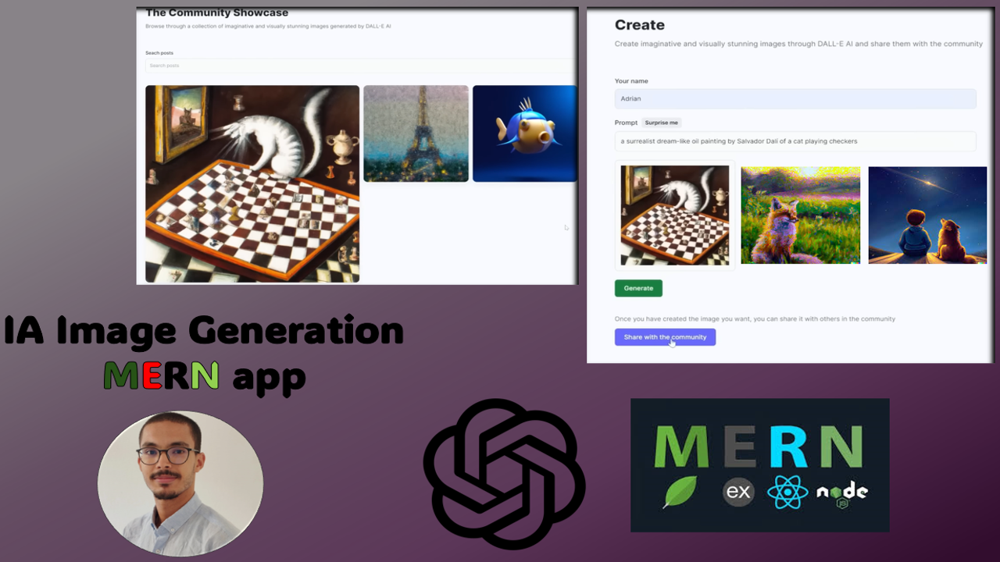

<div align="center">
  
  <h1 style='color:#4c4893' align='center'>
    MERN Stack AI Image Generation App
  </h1>


  
</div>

<div style="background-color:white; color:black; font-size:15px; font-family:Comic Sans MS; padding:10px; border: 5px solid black;font-weight:bold;border-radius: 20px;">
    Build and Deploy a Full Stack MERN AI Image Generation App with MERN stack (MongoDB , Express , React and Nodejs) using Open AI's DALL-E API.<br>
</div>


### Dependencies
You should install the dependencies using
```bash
npm install
``` 

### Assets

You should get your 
* OPENAI_API_KEY : For the DALL-E Api 
* MONGODB_URL : Register to MongoDB atlas and create your database there
* CLOUDINARY_CLOUD_NAME ;CLOUDINARY_API_KEY ;CLOUDINARY_API_SECRET : Create your account in CLOUDINARY for speed images rendring.

### Run Locally

<div style="background-color:#4c4893; color:white; font-size:15px; font-family:Comic Sans MS; padding:10px; border: 5px solid black;font-weight:bold;border-radius: 20px;text-align:center"> ✨ THE END ✨</div><br>